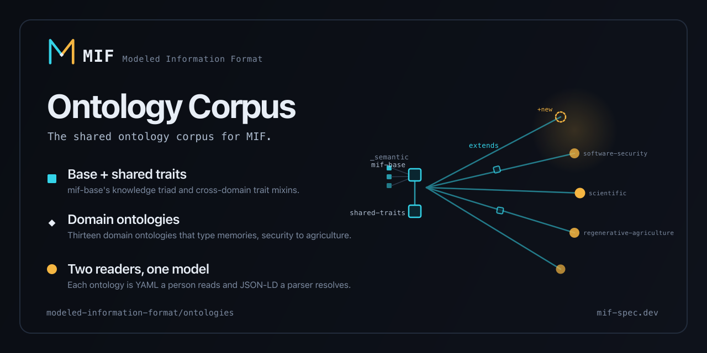

<p align="center">
  
</p>

# MIF Ontology Corpus

The central, growing corpus of ontologies for the **Modeled Information Format
(MIF)**. An ontology here is one model read two ways: the `*.ontology.yaml` a
person reads and the `*.ontology.jsonld` a parser resolves. It types MIF
memories so a fact recorded in one domain means the same thing everywhere it
travels.

A domain does not invent its own vocabulary. It `extends` a shared base and adds
only what is its own.

**New here?** Start with [the ontology model](docs/explanation/ontology-model.md)
for the why, then [author your first ontology](docs/tutorial/author-your-first-ontology.md)
for the how.

## What's in the corpus

Every ontology is one flat pair of files under `ontologies/`: the
`<name>.ontology.yaml` a person reads and the generated `<name>.ontology.jsonld`
a parser resolves.

| Layer | Files | What it is |
| --- | --- | --- |
| Base | [`mif-base.ontology.yaml`](ontologies/mif-base.ontology.yaml) | The knowledge triad (`_semantic`, `_episodic`, `_procedural`) and the core traits `timestamped`, `confidence`, `provenance` |
| Shared traits | [`shared-traits.ontology.yaml`](ontologies/shared-traits.ontology.yaml) | Cross-domain trait mixins (`located`, `measured`, `auditable`, `lifecycle`, and more) every domain can compose |
| Intermediate bases | [`engineering-base`](ontologies/engineering-base.ontology.yaml), [`mif-generic`](ontologies/mif-generic.ontology.yaml) | `engineering-base` adds shared engineering supertypes; `mif-generic` adds always-on generic entity types |
| Domain ontologies | [`ontologies/*.ontology.yaml`](ontologies/) | 13 domain ontologies, including `software-security`, `scientific`, `regenerative-agriculture`, `regulatory-legal`, and `trend-analysis` |

The full catalog, with every ontology, version, namespace, and trait, is the
[corpus reference](docs/reference/ontology-corpus.md).

## How the model fits together

A domain ontology declares what it builds on, then defines its own entity types
by composing inherited traits:

```yaml
ontology:
  id: regenerative-agriculture
  version: "0.1.0"
  extends:
    - mif-base        # the namespace triad + core traits
    - shared-traits   # the cross-domain mixins

entity_types:
  - name: field
    base: semantic
    traits: [bounded, measured, seasonal]   # inherited from shared-traits
    schema:
      required: [name, acres, farm_id]
      properties:
        acres: { type: number }
```

Traits, namespaces, relationships, and discovery patterns are inherited; entity
types are not, so each ontology defines its own. See
[the ontology model](docs/explanation/ontology-model.md) for the reasoning, and
[ADR 0001](docs/decisions/0001-underscore-prefixed-base-namespaces.md) for why
base-type namespaces carry the `_` prefix.

A memory then names the ontology it conforms to:

```yaml
ontology:
  id: regenerative-agriculture
  version: "0.1.0"
namespace: _semantic/entities
```

## Documentation

Organized by [Diátaxis](https://diataxis.fr/): learning, tasks, reference, and
understanding.

| Mode | Document |
| --- | --- |
| Tutorial | [Author your first ontology](docs/tutorial/author-your-first-ontology.md) |
| How-to | [Add a domain ontology](docs/how-to/add-a-domain-ontology.md) · [Submit an ontology](docs/how-to/submit-an-ontology.md) |
| Reference | [Ontology corpus reference](docs/reference/ontology-corpus.md) |
| Explanation | [The ontology model](docs/explanation/ontology-model.md) |
| Runbooks | [Release the corpus](docs/runbooks/release-the-corpus.md) · [Diagnose a CI gate failure](docs/runbooks/ci-gate-failure.md) |
| Decisions | [ADR 0001: underscore-prefixed base namespaces](docs/decisions/0001-underscore-prefixed-base-namespaces.md) |

## Contributing

New ontologies and improvements are welcome. The
[submission guide](docs/how-to/submit-an-ontology.md) walks the full path: author,
validate, open a PR, pass the gates, and release.

## CI backbone

Releases ride the org's **attested release pipeline**: every published artifact
carries SLSA provenance and an SBOM, every security gate verdict is signed, and
publication is fail-closed on verification. The mechanics live in
[the attested pipeline](docs/explanation/attested-pipeline.md) and the
[gates reference](docs/reference/gates.md); the operational steps are the
[release runbook](docs/runbooks/release-the-corpus.md).

## License

[MIT](LICENSE).
