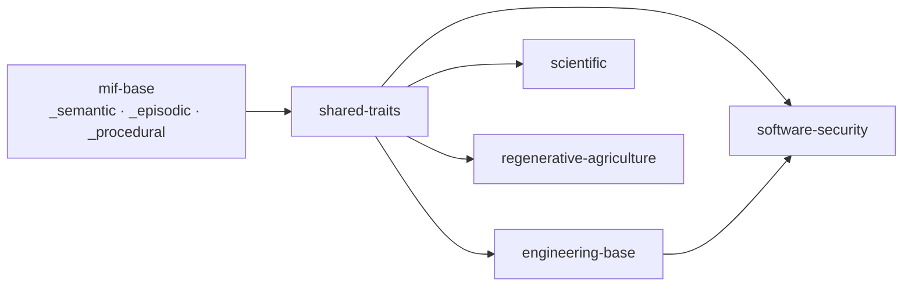

## How the corpus fits together

A domain ontology does not invent its own vocabulary. It `extends` a shared base
and adds only what is its own — the machine-cyan typed base every domain builds
on, the human-amber meaning each domain contributes.

Each ontology is one pair of files: the `*.ontology.yaml` a person reads and the
generated `*.ontology.jsonld` a parser resolves. Start with
[the ontology model](explanation/ontology-model/) for the why, then
[author your first ontology](tutorial/author-your-first-ontology/) for the how.
